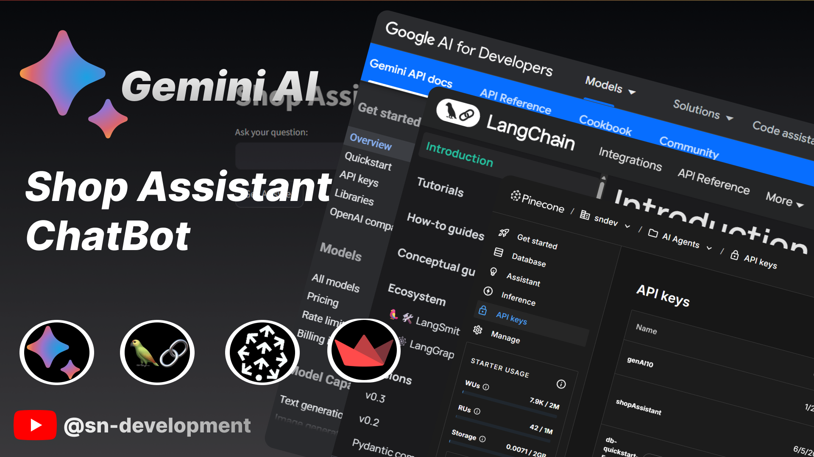

# 🛒 Shop Assistant Chatbot (RAG-Based)



A Retrieval-Augmented Generation (RAG) powered chatbot that acts as a smart assistant for your shop or product catalog. This application integrates LangChain, Pinecone, and Google Gemini to build a real-world, production-ready AI chatbot that understands user queries based on your own data.

---

## 📌 Features

- 🔍 Contextual question-answering based on shop product data
- 🧠 Embedding generation using Google Gemini
- 📦 Vector storage and retrieval using Pinecone
- 💬 Natural language responses via Large Language Model (LLM)
- 🌐 Streamlit web interface for user interaction

---

## 🗂 Project Structure

```
shop-assistant-chatbot/
|── .env                            # Environment variables
|── app.py                          # Streamlit app UI logic
│── data_ingestion.py               # Uploading data to MySQL Database
│── integration.ipynb               # RAG generation logic with LLM
│── README.md                       # -----------------------
│── requirements.txt                # Python dependencies
│── cleaned_products_catalog.csv    # Sample shop catalog data
|── shopassistant.pdf               # Process Funnel & Architecture
│── sync_pinecone.py                # Syncing with Pinecone DB

```

---

## 🚀 Getting Started

### 1. Clone the Repository

```bash
git clone https://github.com/your-username/ShopAssistantChatbot.git
cd ShopAssistantChatbot
```

### 2. Setup Python Environment

```bash
python -m venv venv
source venv/bin/activate  # Windows: venv\Scripts\activate
pip install -r requirements.txt
```

### 3. Configure Environment Variables

Create a `.env` file in the root directory:

```env
GOOGLE_API_KEY=your_google_api_key
PINECONE_API_KEY=your_pinecone_api_key
DB_PASSWORD=your_mysql_password
```

### 4. Ingest Data

Run the MySQL ingestion script:

```bash
python data_ingestion.py
```

Then sync data to Pinecone:

```bash
python sync_pinecone.py
```

### 5. Launch Streamlit App

```bash
streamlit run app.py
```

---

## 📊 Technologies Used

- **LangChain** – RAG orchestration
- **Pinecone** – Vector database
- **Google Gemini API** – Embedding and LLM
- **Streamlit** – UI for chatbot
- **MySQL** – Product catalog storage

---

## 📦 Upcoming Features (Planned in Next Versions)

- User authentication
- Admin dashboard with session control
- Feedback loop for model improvement
- Multi-user chat tracking
- Docker deployment

---

## 🧑‍💻 Author

**Supratim Nag** – AIML | GenAI | AgenticAI Developer

📺 [YouTube Channel](https://youtube.com/@sn-develpoment) | 🐦 [X (Twitter)](https://twitter.com/snsupratim)

---

## 📄 License

This project is licensed under the MIT License.

---

> "Train your own AI. Power your own data."
